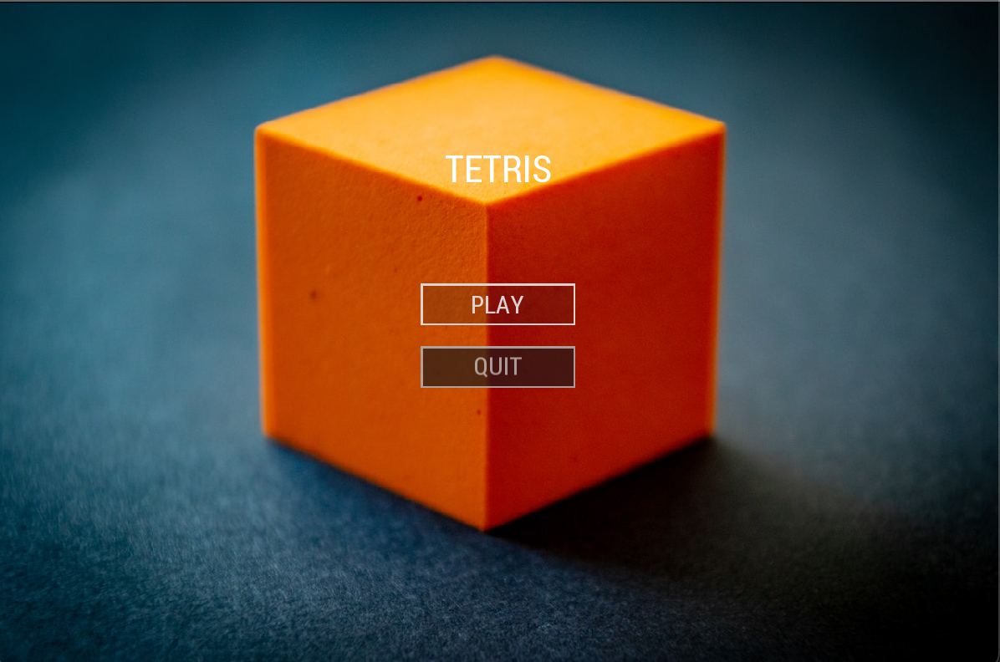

# Tetris
## Simple 2D Tetris game made with Skeleton and SFML. 

## Screenshots:
### Main menu made using Skeleton
 
### Game
 

# How to build
## CMake
Download [SFML](https://www.sfml-dev.org/download/sfml/2.5.1/) compatible with your compiler and extract it to folder
in the project or use your package manager to download the library.

## Linux
Root project Makefile takes care of building the project. It accepts two flags that are passed to CMake.
* `CMAKE_BUILD_TYPE` - the build type. If not specified `Debug` is used.
* `SFML_DIR` - CMake configuration path. This should be used when SFML was installed manually to tell `find_package` where
to search SFML for.
### Example: Linux with defualt parameters
```
make
build/Sandbox
```

### Example: Linux with non default parameters
This shows `CMAKE_BUILD_TYPE` and `SFML_DIR` passed as parameters. This assumes SFML was downloaded and extracted in
`vendor` folder.
```
make CMAKE_BUILD_TYPE=Release SFML_DIR=vendor/SFML-2.5.1/lib/cmake/SFML
build/Sandbox
```

## Windows
### Example: Windows Visual Studio
CMake should take care of creating the solution files. As this example does not use Makefile, you need to pass the
`SFML_DIR` parameter directly to CMake:
```
mkdir build
cd build
cmake -DSFML_DIR="vendor\SFML-2.5.1\lib\cmake\SFML"  ..

# for 32 bit version:
# cmake -A Win32 -DSFML_DIR="vendor\SFML-2.5.1\lib\cmake\SFML"  ..
```
After that open generated solution file and hit build. 
Copy needed dlls to binary location.
Note: You may need to set Sandbox as the startup project.

### Example: Windows MinGW Makefiles
This works similiar to the previous example but uses different generator.
```
mkdir build
cd build
cmake -G "MinGW Makefiles" -DSFML_DIR="vendor\SFML-2.5.1\lib\cmake\SFML"  ..
make
# run the app after copying dll files
Sandbox.exe
```
